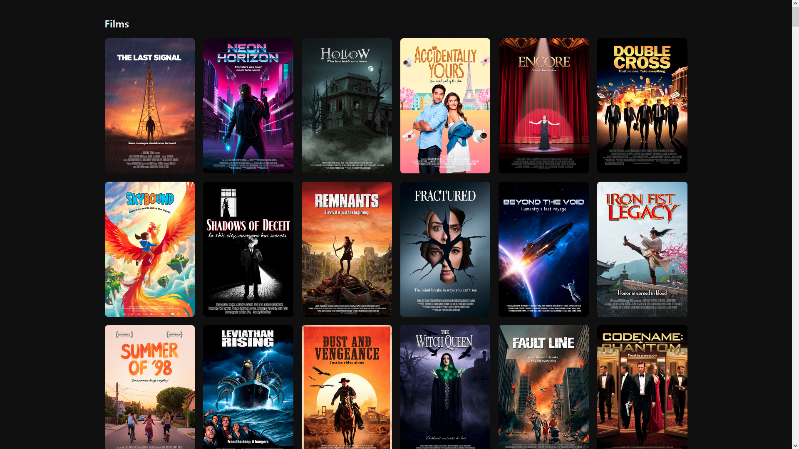
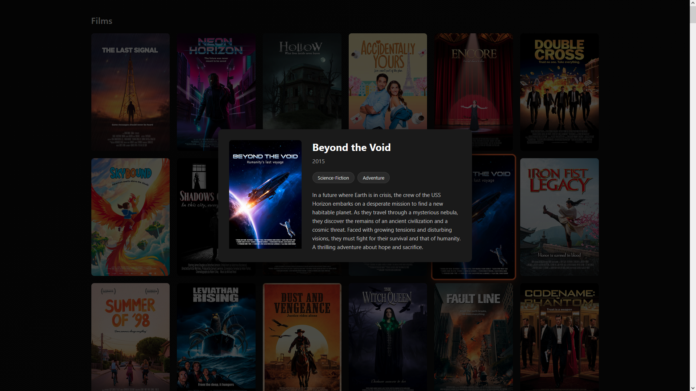
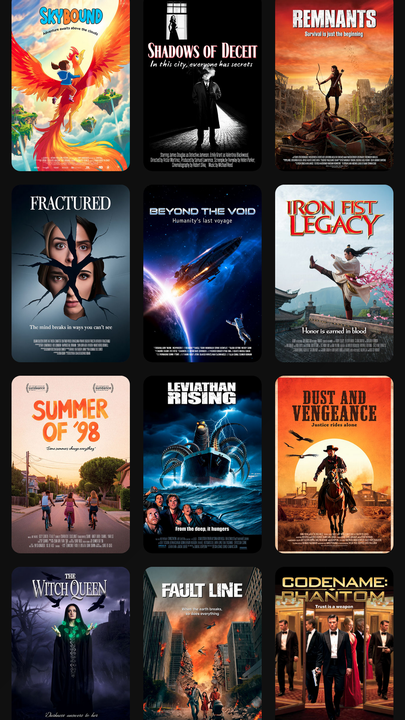
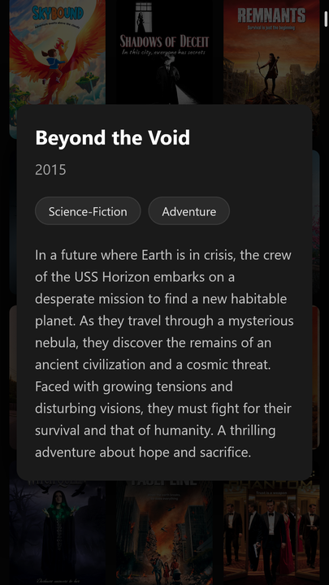

# Kodi HTML Poster Wall

## About

This script generates an HTML poster wall from an XML-exported Kodi database. It was coded by Claude Haiku 4.5 from my specs. It isn't supposed to replace a proper media interface like Kodi, Plex or Jellyfin – think of it as a quick way to display your collection. You still have to browse and open your media with an external player. **This is just for show.**

## Usage

1. In Kodi, export your media database (only movies and TV shows are supported) to a local folder, as a single file. It will create a "videodb.xml" file, along with a handful of subfolders containing lots of images: you can deleted all of those images as they won't be used.

2. Place this .py script in the same folder as "videodb.xml" and run it. All the poster images will be downloaded (it can take a while so be patient!) in an "images" subfolder, then an "index.html" file will be created.

3. The poster images will be about 1000\*1500 pixels large; that's huge, so use your favourite tool to batch-resize them all to something lighter (e.g. 400*600).

4. Open "index.html" in a web browser and enjoy your library presented in a clean responsive grid, alphabetically sorted, grouped by folder and type (movies first, TV shows last). Clicking a poster opens a modal card with more info (title, year, genres, plot).

## Screenshots

&nbsp;&nbsp;
